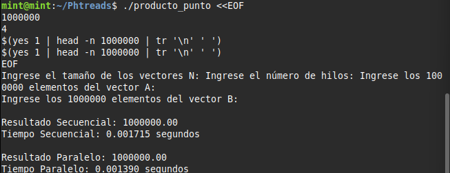

# Tarea con Pthreads - Kenny Martínez Fuentes

Este proyecto implementa el cálculo del **producto punto** entre dos vectores utilizando **Programación Paralela con Pthreads**, como parte de la tarea de laboratorio de **Programación Paralela**. Se compara el rendimiento entre la versión secuencial y la versión paralela.

---

## 1. Instalación de dependencias en Linux

Este proyecto utiliza la librería **Pthreads** de POSIX para paralelizar el cálculo del producto punto.  
En sistemas basados en Debian o Ubuntu, puedes instalar las herramientas necesarias con:

```bash
sudo apt update
sudo apt install build-essential
```
## 2. Elegir un Editor de Código
Puedes usar cualquier editor, como por ejemplo:

- Visual Studio Code
- nano, vim, gedit (editores en terminal)
- CLion, Code::Blocks, o cualquier entorno C compatible

## 3. Explicación del Código
El programa realiza las siguientes acciones:

- Solicita el tamaño N de los vectores y el número de hilos.
- Lee los elementos del vector A y del vector B desde la entrada estándar.
- Calcula el producto punto de los vectores de dos formas:
  A. De forma secuencial
  B. De forma paralela usando pthreads

- Mide y muestra el tiempo de ejecución de ambas versiones usando la función clock() de la librería <time.h>.
- Compara los resultados y tiempos.

## 4. Compilación
Se guarda el archivo fuente como producto_punto.c y compílalo con:
```bash
gcc -o producto_punto producto_punto.c -lpthread
```

## 5. Ejecución
Se puede ejecutar el programa de forma interactiva o con un test automatizado para validar el rendimiento.
```bash
./producto_punto <<EOF
1000000
4
$(yes 1 | head -n 1000000 | tr '\n' ' ')
$(yes 1 | head -n 1000000 | tr '\n' ' ')
EOF
```
## 6. Resultado
A continuación se muestra una imagen con los tiempos de ejecución para la versión secuencial y la versión paralela:


